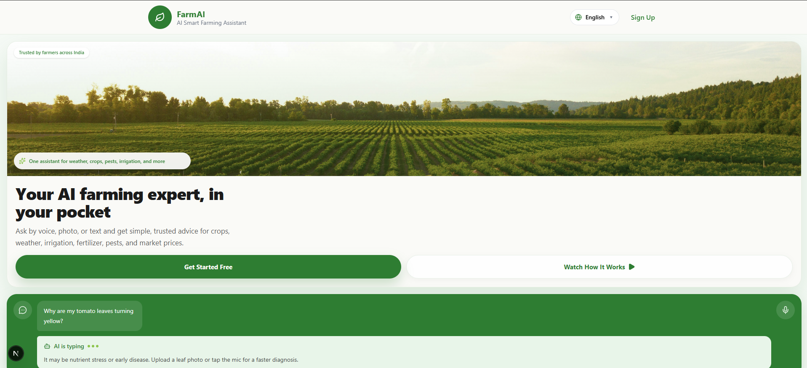

# 🌱 FarmAI — AI Smart Farming Assistant

> **An AI-powered farming companion built to help farmers make smarter decisions about crops, weather, diseases, fertilizers, irrigation, markets, and government schemes.**

FarmAI is a modern, multilingual, AI-powered smart farming assistant designed primarily for farmers in India.

The goal is simple:

**Make useful agricultural intelligence accessible to every farmer through a simple, friendly, and voice-enabled interface.**

---

## 📸 Landing Page Preview

<!-- Replace the path below with your actual landing page screenshot -->



> 💡 **Add your landing page screenshot here:**
> Create a `screenshots` folder in the project root and place your image inside it as `landing-page.png`.

---

## ✨ Why FarmAI?

Farmers often need to make important decisions based on many different factors:

* 🌦️ Weather conditions
* 🌱 Crop selection
* 🦠 Plant diseases
* 🐛 Pest attacks
* 💧 Irrigation requirements
* 🧪 Fertilizer usage
* 💰 Market prices
* 🏛️ Government schemes

FarmAI brings these capabilities together into **one intelligent farming assistant**.

Instead of forcing farmers to understand different agricultural tools, FarmAI provides a single conversational interface where they can simply ask:

> **"Will it rain this week?"**

> **"What disease does my tomato plant have?"**

> **"How much fertilizer should I use?"**

> **"Should I sell my wheat today?"**

> **"Are there any government schemes available for me?"**

The AI determines what kind of help is required and provides an appropriate response.

---

# 🚀 Features

## 🤖 AI Farming Assistant

Farmers can interact with FarmAI using natural language.

The assistant supports:

* Text-based conversations
* Voice input
* Image-based queries
* Context-aware follow-up questions
* Smart suggestions
* Farming recommendations
* Conversation history

---

## 🦠 Disease Detection

Farmers can upload or capture an image of their crop.

FarmAI provides:

* Disease prediction
* Confidence information
* Symptoms
* Recommended actions
* Prevention techniques
* Precautions
* Follow-up guidance

The current disease model is designed as a **classification model**.

The architecture also leaves room for future visual explainability features such as Grad-CAM.

---

## 🌦️ Weather Intelligence

FarmAI provides useful weather information for farming decisions.

The weather experience can include:

* 🌡️ Temperature
* 💧 Humidity
* 🌧️ Rain probability
* 🌬️ Wind speed
* 🌅 Sunrise
* 🌇 Sunset
* ☁️ Weather condition
* 🌱 Weather-based farming advice

---

## 💧 Smart Irrigation

FarmAI helps farmers decide whether irrigation may be required.

The system can consider factors such as:

* Current weather
* Rain probability
* Farm information
* Crop information
* Water availability

The goal is to provide simple actionable advice such as:

> **"Irrigation is probably not required today because rain is expected."**

---

## 🧪 Fertilizer Recommendations

FarmAI can provide fertilizer-related guidance including:

* Recommended fertilizer
* Why it may be needed
* Application method
* Precautions
* Alternative options

Recommendations can be personalized using the farmer's stored farm information.

---

## 🐛 Pest Management

The assistant can help farmers understand:

* Possible pests
* Pest-related symptoms
* Recommended actions
* Prevention methods
* Precautions

---

## 🌾 Crop Recommendation

FarmAI can recommend suitable crops using information such as:

* Soil type
* Season
* Weather
* Farm size
* Water source
* Previous crops

The system is designed to work even when some information is unavailable.

---

## 💰 Market Intelligence

FarmAI can help farmers understand:

* Crop prices
* Price trends
* Nearby markets
* Market comparisons
* Price-related insights

This can help farmers make better selling decisions.

---

## 🏛️ Government Schemes

FarmAI can help farmers discover potentially relevant government schemes.

Information can include:

* Scheme name
* Eligibility
* Benefits
* Required documents
* Official resources
* Saved schemes

---

# 🗣️ Multilingual Support

FarmAI is designed for India's multilingual environment.

Currently supported languages include:

| Language      | Code |
| ------------- | ---- |
| 🇬🇧 English  | `en` |
| 🇮🇳 Hindi    | `hi` |
| 🇮🇳 Bengali  | `bn` |
| 🇮🇳 Marathi  | `mr` |
| 🇮🇳 Gujarati | `gu` |
| 🇮🇳 Kannada  | `kn` |
| 🇮🇳 Tamil    | `ta` |
| 🇮🇳 Telugu   | `te` |

The interface and AI experience can adapt according to the selected language.

Voice interaction also supports language-specific speech recognition.

---

# 🎙️ Voice-First Experience

Many farmers may find typing inconvenient.

FarmAI therefore supports voice interaction.

The application can:

1. 🎙️ Listen to the farmer
2. 📝 Convert speech into text
3. 🤖 Process the question
4. 💬 Generate an AI response
5. 🔊 Provide voice-friendly responses

The UI provides visual feedback while the assistant is listening.

---

# 🌱 My Farm

Farmers can optionally save information about their farm.

Stored information can include:

* 👨‍🌾 Farmer name
* 📍 State
* 📍 District
* 🌱 Soil type
* 💧 Water sources
* 📐 Farm size
* 🌾 Previous crops
* 🌐 Preferred language
* 📍 Geographic location

This information can be used to personalize future AI recommendations.

---

# 💬 Chat History

FarmAI maintains previous farming conversations so users can return to earlier discussions.

Users can:

* View previous conversations
* Open old chats
* Delete conversations
* Start new conversations

---

# 🧠 Multi-Agent AI Architecture

FarmAI uses a multi-agent architecture behind the scenes.

The farmer doesn't need to know which AI agent handles a request.

A routing layer determines which specialized agent should process the question.

```text
                         
```

### Specialized Agents

* 🌾 Crop Recommendation Agent
* 🌦️ Weather Agent
* 🦠 Disease Agent
* 🧪 Fertilizer Agent
* 💧 Irrigation Agent
* 🐛 Pest Management Agent
* 💰 Market Agent
* 🏛️ Government Scheme Agent
* 💬 Fallback / General Assistant

The objective is to make the experience feel like **one intelligent agricultural assistant**, even though specialized agents work behind the scenes.
                         ┌──────────────────┐
                         │      Farmer      │
                         └────────┬─────────┘
                                  │
                                  ▼
                         ┌──────────────────┐
                         │   FarmAI Chat    │
                         └────────┬─────────┘
                                  │
                                  ▼
                         ┌──────────────────┐
                         │    AI Router     │
                         │    LangGraph     │
                         └────────┬─────────┘
                                  │
       ┌──────────────┬───────────┼───────────┬──────────────┐
       │              │           │           │              │
       ▼              ▼           ▼           ▼              ▼
 ┌──────────┐   ┌──────────┐ ┌──────────┐ ┌──────────┐ ┌──────────┐
 │ Weather  │   │ Disease  │ │  Market  │ │Fertilizer│ │Irrigation│
 │  Agent   │   │  Agent   │ │  Agent   │ │  Agent   │ │  Agent   │
 └──────────┘   └──────────┘ └──────────┘ └──────────┘ └──────────┘
       │              │           │           │              │
       │              │           │           │              │
       └──────────────┴───────────┼───────────┴──────────────┘
                                  │
                         ┌────────┴────────┐
                         │                 │
                         ▼                 ▼
                   ┌──────────┐     ┌──────────────┐
                   │   Pest   │     │ Government   │
                   │  Agent   │     │ Scheme Agent │
                   └──────────┘     └──────────────┘
---

# 🏗️ Project Architecture

The project is organized into separate frontend and backend services.

```text
FarmAI
│
├── Frotend
│   └── Next.js
│
├── Backend
│   ├── FastAPI
│   └── AI / Agent Services
│
└── Data & Services
    ├── MongoDB
    ├── Redis
    ├── Groq
    ├── Clerk
    └── External APIs
```

---

# 🛠️ Tech Stack

## Frontend

* **Next.js**
* **React**
* **Tailwind CSS**
* **next-intl**
* **Clerk**
* **Lucide React**
* **Framer Motion**
* **Axios**
* **SweetAlert2**

## Backend

* **FastAPI**
* **Python**
* **Uvicorn**
* **LangGraph**
* **AI Agents**

## AI

* **Groq**
* Specialized AI agents
* Agent routing
* AI-powered recommendations

## Database & Infrastructure

* **MongoDB Atlas**
* **Redis**
* **Cloudinary**

## Authentication

* **Clerk**

---

# 🌐 Internationalization

FarmAI uses `next-intl` for multilingual support.

The application follows a locale-based structure:

```text
src/
└── app/
    └── [locale]/
        ├── page.js
        ├── layout.js
        └── ...
```

Translation files are organized by language:

```text
locales/
│
├── en/
├── hi/
├── bn/
├── mr/
├── gu/
├── kn/
├── ta/
└── te/
```

Each language can contain translation files for different parts of the application.

For example:

```text
locales/
└── en/
    ├── landing.json
    ├── dashboard.json
    ├── settings.json
    ├── history.json
    ├── bottomNav.json
    ├── weatherCard.json
    └── welcomeCard.json
```

---

# 🔐 Authentication

Authentication is handled using **Clerk**.

The application supports:

* Sign up
* Sign in
* User sessions
* Protected routes
* Profile information
* Logout

Protected routes are handled through middleware.

---

# 📱 Responsive Design

FarmAI follows a mobile-first design approach.

The interface is designed for:

* 📱 Smartphones
* 📲 Tablets
* 💻 Desktop screens

Important design principles include:

* Large touch targets
* One-hand usability
* Simple navigation
* Minimal typing
* Voice-first interaction
* Accessible UI
* Clear visual hierarchy

---

# ⚡ Getting Started

## 1. Clone the repository

```bash
git clone https://github.com/Prachi-Gupta456/FARMAI
```

```bash
cd FARMAI
```

---

## 2. Install frontend dependencies

```bash
npm install
```

---

## 3. Configure environment variables

Create a `.env.local` file for the frontend.

Example:

```env
NEXT_PUBLIC_API_URL=your_backend_url

NEXT_PUBLIC_CLERK_PUBLISHABLE_KEY=your_clerk_publishable_key
CLERK_SECRET_KEY=your_clerk_secret_key
```

Add the required environment variables for your own services.

> ⚠️ Never commit API keys, secrets, or `.env` files to GitHub.

---

## 4. Start the frontend

```bash
npm run dev
```

The application will be available at:

```text
http://localhost:3000
```

---

# 🐍 FastAPI Backend

If the FastAPI backend is located in a separate directory:

```bash
cd fastapi_backend
```

Create and activate a virtual environment.

### Windows

```bash
python -m venv venv
```

```bash
venv\Scripts\activate
```

### Linux / macOS

```bash
python3 -m venv venv
```

```bash
source venv/bin/activate
```

Install dependencies:

```bash
pip install -r requirements.txt
```

Start the backend:

```bash
uvicorn main:app --reload
```

The API will be available at:

```text
http://localhost:8000
```

FastAPI documentation:

```text
http://localhost:8000/docs
```

---

# 🚀 Deployment

FarmAI can be deployed using separate frontend and backend services.

### Frontend

Recommended:

**Vercel**

```text
Next.js → Vercel
```

### Backend

The FastAPI backend can be deployed using a cloud platform that supports Python web services.

```text
FastAPI → Cloud Platform
```

After deployment, configure:

```env
NEXT_PUBLIC_API_URL=https://your-backend-url
```

in the frontend environment variables.

---

# 🔒 Security Notes

Never expose sensitive credentials in frontend code.

Keep secrets such as:

```text
GROQ_API_KEY
MONGO_URI
CLERK_SECRET_KEY
REDIS_URL
CLOUDINARY_API_SECRET
```

inside server-side environment variables.

Do not commit:

```text
.env
.env.local
.env.production
```

to GitHub.

---

# 🔮 Future Improvements

FarmAI can be extended with:

* 📊 Crop health analytics
* 🔔 Smart agricultural alerts
* 🧾 Downloadable farming reports
* 📷 Advanced disease visualization
* 🗣️ More Indian languages
---

# 🎯 Vision

FarmAI is more than a chatbot.

The long-term vision is to build a **personal AI farming companion** that understands a farmer's:

* Farm
* Crops
* Soil
* Location
* Weather
* Water availability
* Farming history
* Market conditions

and turns all of that information into simple, practical decisions.

> **Technology should not make farming more complicated.
> It should make better farming easier. 🌱**

---

# 👨‍💻 Author

**Prachi Gupta**

Computer Science Student & Developer

Built with ❤️ and 🌱 for smarter farming.

---

## ⭐ Support the Project

If you find FarmAI useful or interesting, consider giving the repository a ⭐ on GitHub.

Your support helps the project grow! 🌱
